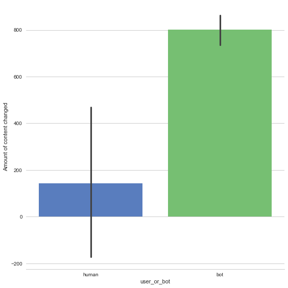
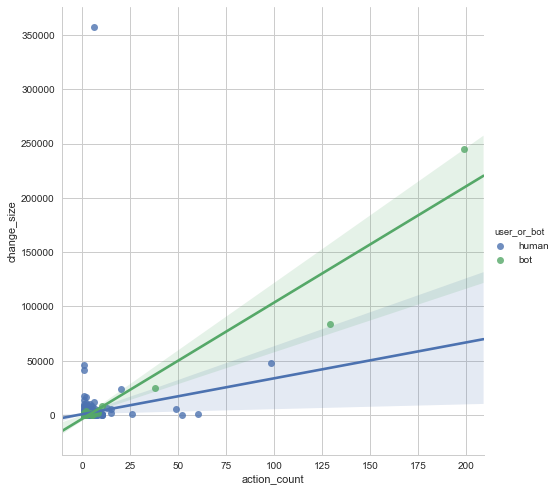
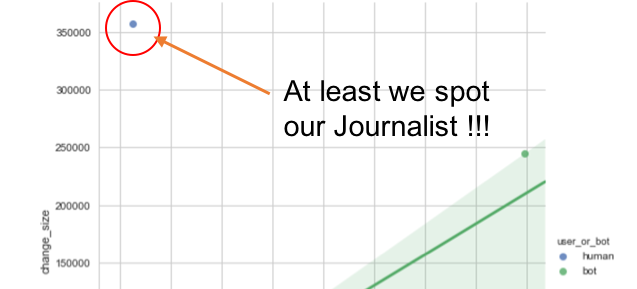

# The Oldest Profession Is Not What You Think

## Contrary to what you have been told, the oldest profession is actually Journalist:
"a person who writes for newspapers, magazines, or news websites or prepares news to be broadcast."

------------------------------------------------

Author: Carlos Rodrigues


Report_date: xx\_05\_2017

------------------------------------------------

Contrary to what you've heard, **journalist** is the oldest profession in the world, because “In the beginning”, someone had to have been there when Eve and Adam ate the apple from the forbidden tree! Otherwise how could we ever know where humanity began?

However the reality as we know it, started to change...


```python
import pandas as pd
import json
import re
import warnings
warnings.filterwarnings('ignore')

import numpy as np
import matplotlib.pyplot
%matplotlib inline

import seaborn as sns
```

The data was aquired and saved to a file using a separated python script (find on attachment).


```python
# with open('wiki-data-v2.json') as f:
#     content = f.readlines()
```


```python
# def get_json(string):
#     string = string.replace(',\n', '')
#     return json.loads(string)
```


```python
# df = pd.DataFrame.from_records(map(get_json, content))
```


```python
df = pd.read_json('wiki-data-v999')
```

### The story that follows is told around a chunk of data from Wikipedia (precisly Wikipedia metadata). The fun came up by noticing the top user names per amount of actions performed on Wikipedia!


```python
df.groupby('user')['action'].count() \
                            .reset_index(name='count') \
                            .sort_values(['count'], ascending=False) \
                            .head(10)
```


<div>
<table border="1" class="dataframe">
  <thead>
    <tr style="text-align: right;">
      <th></th>
      <th>user</th>
      <th>count</th>
    </tr>
  </thead>
  <tbody>
    <tr>
      <th>370</th>
      <td>HostBot</td>
      <td>199</td>
    </tr>
    <tr>
      <th>384</th>
      <td>InternetArchiveBot</td>
      <td>129</td>
    </tr>
    <tr>
      <th>228</th>
      <td>BD2412</td>
      <td>98</td>
    </tr>
    <tr>
      <th>226</th>
      <td>AvalerionV</td>
      <td>60</td>
    </tr>
    <tr>
      <th>385</th>
      <td>Iridescent</td>
      <td>52</td>
    </tr>
    <tr>
      <th>662</th>
      <td>William Avery</td>
      <td>49</td>
    </tr>
    <tr>
      <th>542</th>
      <td>Onel5969</td>
      <td>49</td>
    </tr>
    <tr>
      <th>382</th>
      <td>InceptionBot</td>
      <td>38</td>
    </tr>
    <tr>
      <th>278</th>
      <td>Corkythehornetfan</td>
      <td>26</td>
    </tr>
    <tr>
      <th>251</th>
      <td>CAPTAIN RAJU</td>
      <td>21</td>
    </tr>
  </tbody>
</table>
</div>


## Fact: some of the usernames end up in "...Bot"

Hum, ok there is a variable that identifies the Bots ("is_bot") but is it trustful? Lets check ourselves if it capture all the obviouse Bot usernames?


```python
bot_df = df[['user', 'action', 'is_bot', 'change_size', 'ns']]
regex = r'.*[bB][oO][tT]'
bot_df['my_is_bot'] = df.user.str.match(regex)
bot_df.head(5)
```


<div>
<table border="1" class="dataframe">
  <thead>
    <tr style="text-align: right;">
      <th></th>
      <th>user</th>
      <th>action</th>
      <th>is_bot</th>
      <th>change_size</th>
      <th>ns</th>
      <th>my_is_bot</th>
    </tr>
  </thead>
  <tbody>
    <tr>
      <th>0</th>
      <td>Terriffic Dunker Guy</td>
      <td>edit</td>
      <td>False</td>
      <td>99.0</td>
      <td>Main</td>
      <td>False</td>
    </tr>
    <tr>
      <th>1</th>
      <td>VICTOR ERNESTO RODRIGUEZ</td>
      <td>create</td>
      <td>False</td>
      <td>NaN</td>
      <td>Special</td>
      <td>False</td>
    </tr>
    <tr>
      <th>10</th>
      <td>M2545</td>
      <td>edit</td>
      <td>False</td>
      <td>445.0</td>
      <td>Main</td>
      <td>False</td>
    </tr>
    <tr>
      <th>100</th>
      <td>66.7.227.226</td>
      <td>edit</td>
      <td>False</td>
      <td>-1.0</td>
      <td>Main</td>
      <td>False</td>
    </tr>
    <tr>
      <th>1000</th>
      <td>Hyacinth</td>
      <td>edit</td>
      <td>False</td>
      <td>203.0</td>
      <td>Category</td>
      <td>False</td>
    </tr>
  </tbody>
</table>
</div>


```python
isbot = pd.DataFrame(bot_df.is_bot.value_counts().reset_index())
myisbot = pd.DataFrame(bot_df.my_is_bot.value_counts().reset_index())
check_bots = pd.merge(isbot,myisbot)
check_bots.set_index(check_bots['index']).drop('index', axis = 1)

check_bots
```


<div>
<table border="1" class="dataframe">
  <thead>
    <tr style="text-align: right;">
      <th></th>
      <th>index</th>
      <th>is_bot</th>
      <th>my_is_bot</th>
    </tr>
  </thead>
  <tbody>
    <tr>
      <th>0</th>
      <td>False</td>
      <td>1972</td>
      <td>1759</td>
    </tr>
    <tr>
      <th>1</th>
      <td>True</td>
      <td>222</td>
      <td>435</td>
    </tr>
  </tbody>
</table>
</div>


#### Looks like it doesn't!!! Not all the bot usernames are identified through the "is_bot" variable and perhaps there are other bots non explicit by the username!

But why not filter only by the my_is_bot variable? Since we know it capture 435 bot actions?

(Lets create a new dataframe with all possible bots accounts)


```python
bots = bot_df.query('is_bot == True or my_is_bot == True')
bots.user.count()
```


    436


#### One row has a username that is not crystal clear!


```python
bots.query("is_bot == True and my_is_bot == False")
```


<div>
<table border="1" class="dataframe">
  <thead>
    <tr style="text-align: right;">
      <th></th>
      <th>user</th>
      <th>action</th>
      <th>is_bot</th>
      <th>change_size</th>
      <th>ns</th>
      <th>my_is_bot</th>
    </tr>
  </thead>
  <tbody>
    <tr>
      <th>645</th>
      <td>Ops Monitor (WMF)</td>
      <td>edit</td>
      <td>True</td>
      <td>-9.0</td>
      <td>User</td>
      <td>False</td>
    </tr>
  </tbody>
</table>
</div>


## That's why it is important to never discard data, some important information is in the details!

Lets label this dataset as actions performed by humans or bots


```python
# Just to be faster than an df.apply(...)
bot_df['user_or_bot'] = 'human'
bot_df.loc[(bot_df['is_bot'] == True) | (bot_df['my_is_bot'] == True), 'user_or_bot'] = 'bot'
bot_df.user_or_bot.value_counts()
```


    human    1758
    bot       436
    Name: user_or_bot, dtype: int64


#### 24.8% of the actions were performed by a machines!

What kind of 'Actions' the bots usually perform?


```python
unique_action = bot_df.query("user_or_bot == 'bot'").action.unique()

# Just for the sake of printing the list to show there is only one action, I am using the print as a function,
# which is a "limitation" of python 2.7
from __future__ import print_function
map(lambda x: print(x), unique_action)
```

    edit


    [None]


### Lets visualise the impact in terms of content changed by humans or bots, in Wikipedia!


```python
sns.set(style="whitegrid")

g = sns.factorplot(x="user_or_bot", y="change_size", data=bot_df,
                   size=8, kind="bar", palette="muted")

g.despine(left=True)
g.set_ylabels("Amount of content changed")
```


    <seaborn.axisgrid.FacetGrid at 0x1159faf10>





## Lets pick up from our story

### Wikipedia is the largest and most popular general reference work on the Internet (launched at 2001) 

### Nowadays the content generated or removed from it, is mainly managed and generated by AI, in this case bots!

### Indeed the reality changed, while in the older days content was generated by journalists.


```python
from IPython.display import Image
Image(filename='image2.png')

# Image source:
# http://contentmarketinginstitute.com/2017/03/artificial-intelligence-manual-creation/
# (Good opinion article for further reading) 
```


### Certainly a question that I cannot answer, but maybe the dataset can give us an hint!?


```python
bot_df['action_count'] = 1
```

Selecting only the entries where the action is "edit" because:
 - other actions have NaN values 
 - not bias the analyse since the bots are just present on "edit" actions


```python
bot_df['change_size'] = bot_df['change_size'].abs()
grouped_df = bot_df.query('action == "edit"').groupby('user')[['change_size', 'action_count', 'user_or_bot']].sum()
grouped_df.reset_index(level=0, inplace=True)

joined_df = grouped_df.merge(bot_df[['user', 'user_or_bot']], on='user', how='left').drop_duplicates()
```


```python
joined_df.user_or_bot.value_counts()
```


    human    618
    bot       25
    Name: user_or_bot, dtype: int64


##### Only 25 different Bots are presented in this dataset


```python
g2 = sns.lmplot(y="change_size", x="action_count", hue="user_or_bot", data=joined_df, size=7)
```





### To conclude, it is a fact that Wikipedia, the largest center of information, is actually maily managed by Bots.


```python
Image(filename='journalist1.png')
```





(**note**: we found an outlier which has the human characterictc and and unlikely amount of "change_size", following the initial story we can say he is a "journalist"!)

## Attachement #1

Code used to receive JSONs from wikimon websocket into a file.

import time
from websocket import create_connection
import json

def get_time():
    return time.asctime(time.localtime(time.time())).split(' ')[3]

ws = create_connection("ws://wikimon.hatnote.com:9000")

f = open('xxxxx.xx', 'w')

t_end = time.time() + 10 * 90

while time.time() < t_end:
    result =  ws.recv()
    result = json.loads(result)
    result[u'timestamp'] = get_time()
    json.dump(result, f)
    f.write(',\n')

f.close()
